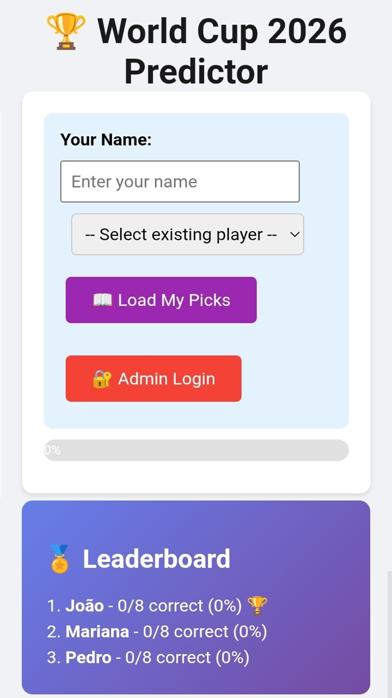
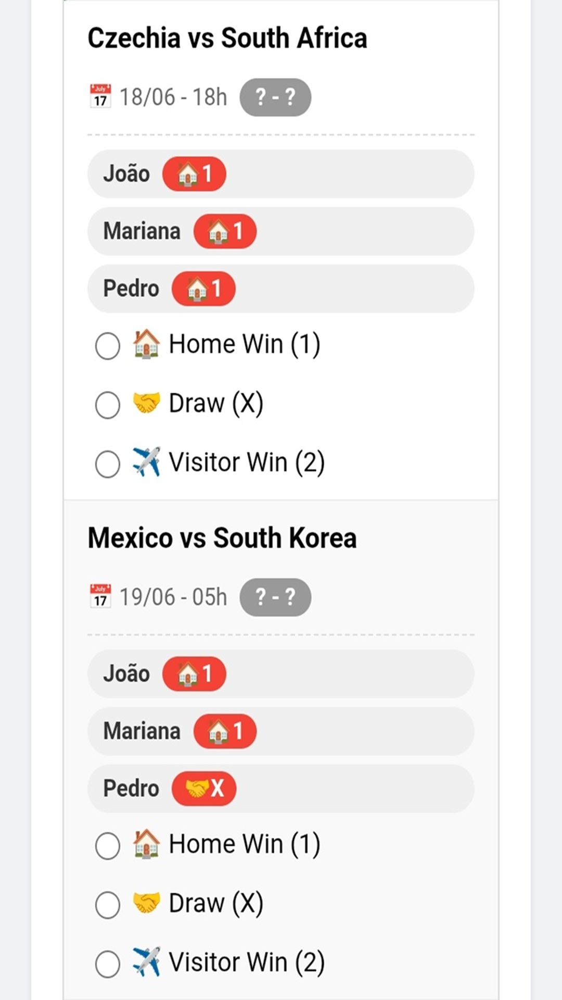
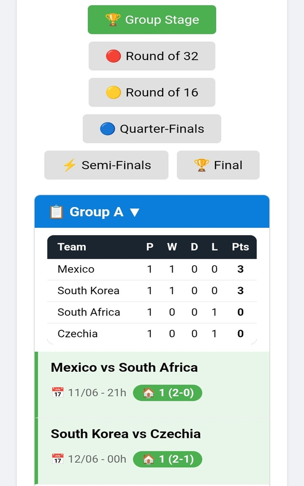
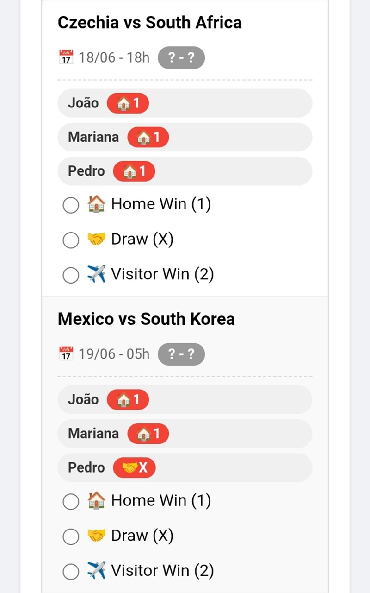

# World Cup 2026 Predictor

A progressive web app for friends to predict World Cup match winners, track scores, and compete on a leaderboard.

## Features

- ✅ Pick prediction on match winners (Home Win, Draw, Visitor Win)
- ✅ Real-time leaderboard
- ✅ Group stage standings
- ✅ Admin panel to enter match results
- ✅ Picks lock automatically after match starts

## Screenshots

### Group Stage View

### Making Picks

### Leaderboard

## Tablet View

| Group Stage | Picks | Leaderboard |
|-------------|-------|-------------|
|  |  |  |

## Installation

1. Visit [https://jocahs.github.io/World-Cup-2026-Predictor/](https://jocahs.github.io/World-Cup-2026-Predictor/)
2. On Android, tap "Install app" or the ↓ icon in the address bar
3. The app will install like a native app on your home screen

## Technologies Used

- HTML5 / CSS3 / JavaScript
- Google Sheets API for data storage
- PWA (Service Worker, Manifest)
- GitHub Pages hosting
